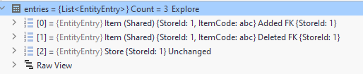

### The issue
After updating `Pomelo.EntityFrameworkCore.MySql` package from version 7.0.0 to 8.0.2 a column that is configured with `.SetAfterSaveBehavior(PropertySaveBehavior.Ignore)` is modified when the entity is updated.

### Steps to reproduce
Please see the working example with the previous package version in the branch `pomelo-v7` and not-so-working example with the new package version in the branch `pomelo-v8`.

Configuration:
```cs
builder
    .Property(x => x.CreatedAt)
    .HasColumnName("createdAt")
    .Metadata.SetAfterSaveBehavior(PropertySaveBehavior.Ignore);

builder
    .Property(x => x.UpdatedAt)
    .HasColumnName("updatedAt")
    .Metadata.SetBeforeSaveBehavior(PropertySaveBehavior.Ignore);
```

In our case parent entity `Store` is always updated together with its child entities `Item`. In real life scenario we have a more convoluted graph of child entities so to simplify the update we load parent from the context and swap its list of children to another list with detached entities.

```cs
var store = context.Stores.First(s => s.StoreId == storeId);

var newItems = CreateItems(request);
store.Items = newItems;

context.SaveChanges();
```

Child entities are created a particular way to utilize `PropertySaveBehavior.Ignore` usage:

```cs
public Item(string itemCode, string name)
{
    var now = DateTime.UtcNow.ToString();
    CreatedAt = now;
    UpdatedAt = now;
    ...
}
```

When a child entity isn't removed it exists in a context in two states: Added and Deleted


In a scenario where a child entity isn't removed we expect its `UpdatedAt` value to be updated and `CreatedAt` to stay the same due to `.SetAfterSaveBehavior(PropertySaveBehavior.Ignore)`.

Expected SQL (with previous package version):

```sql
UPDATE `item` SET `name` = @p0, `updatedAt` = @p1 -- createdAt not set : )
WHERE `itemCode` = @p2 AND `StoreId` = @p3;
```

SQL that gets generated by the newest version:

```sql
UPDATE `item` SET `createdAt` = @p0, `updatedAt` = @p1 -- createdAt is set : (
WHERE `itemCode` = @p2 AND `StoreId` = @p3;
```
